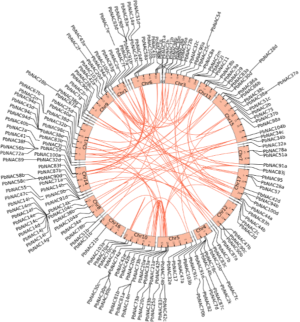
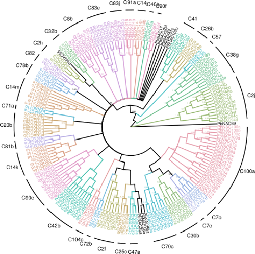
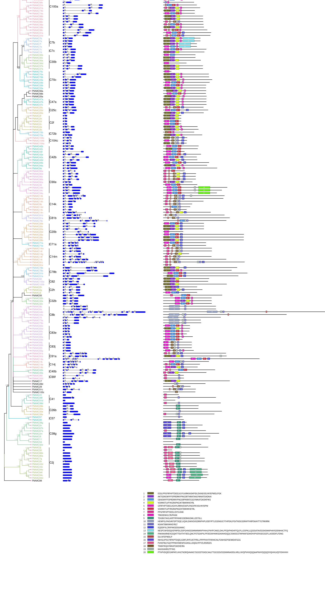
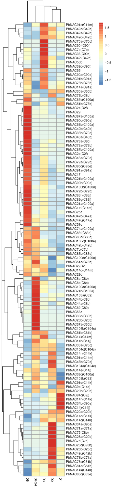
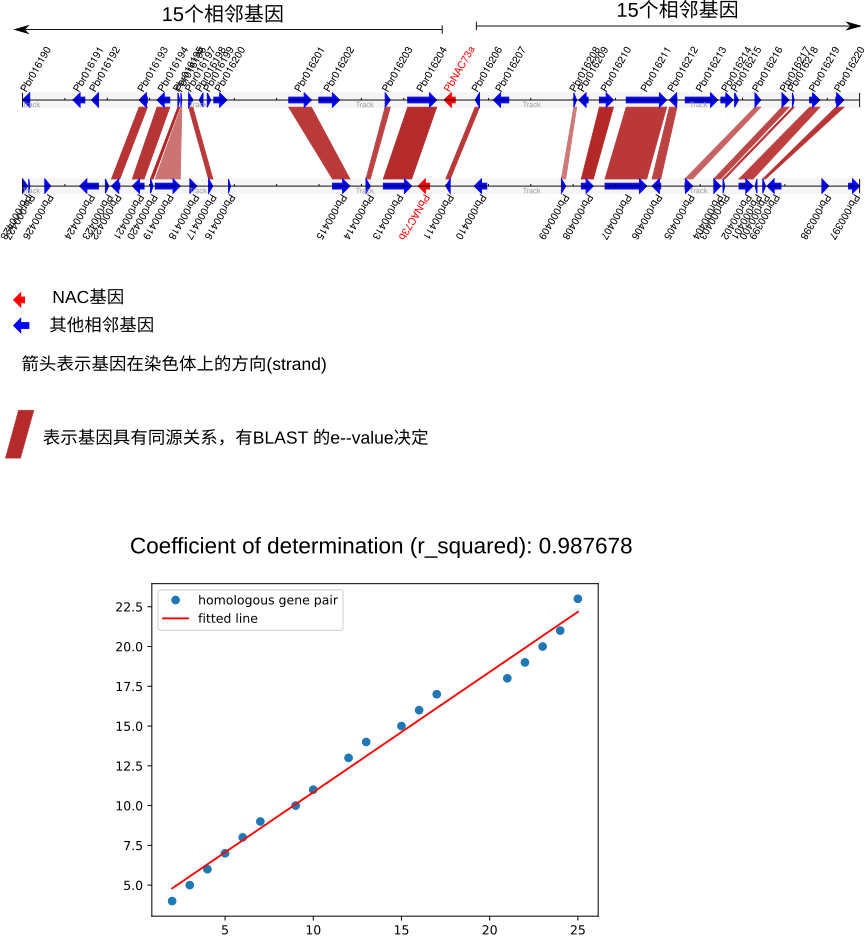
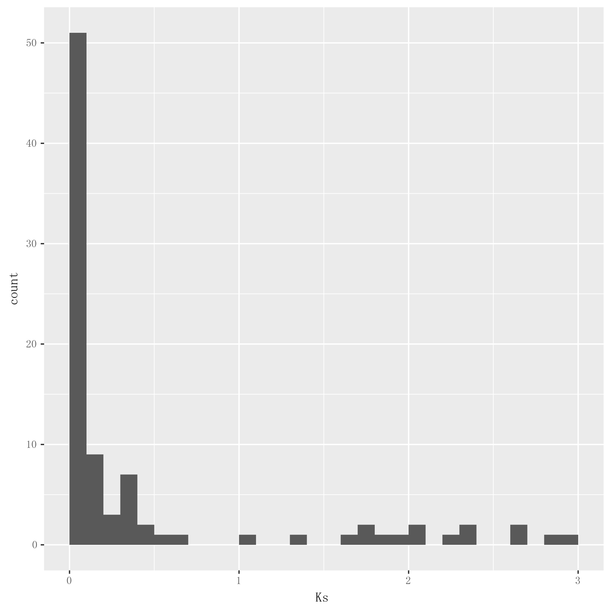

# 基因家族全基因组分析

以梨树NAC基因家族为例，演示基因家族全基因分析内容和方法。

## 系统要求
本文的代码均在Ubuntu18.04操作系统下测试，需要安装Python(3.7.1以上版本)和R(3.4.4以上版本)

### Perl
```
sudo apt install bioperl libtext-trim-perl libsvg-perl
```

R

```R
source("http://bioconductor.org/biocLite.R")
biocLite("ggtree")
biocLite("colorspace")
biocLite("Cairo")
biocLite("pheatmap")
```

### Muscle

`sudo apt install muscle fasttree emboss`

### Interproscan
从ftp://ftp.ebi.ac.uk/pub/software/unix/iprscan/5/下载最新版的InterProScan (64-bit Linux)，并在某一目录下解压缩，例如/opt

```shell
wget -c ftp://ftp.ebi.ac.uk/pub/software/unix/iprscan/5/5.34-73.0/interproscan-5.34-73.0-64-bit.tar.gz
cd /opt
sudo tar xzvf interproscan-5.34-73.0-64-bit.tar.gz
# 在shell路径添加执行程序所在目录
export PATH=$PATH:/opt/interproscan-5.34-73.0
```

```sh
# 下载BLAST
wget -c ftp://ftp.ncbi.nlm.nih.gov/blast/executables/blast+/2.7.1/ncbi-blast-2.7.1+-x64-linux.tar.gz
# 安装
tar xzvf ncbi-blast-2.7.1+-x64-linux.tar.gz
export PATH=$PATH:/opt/ncbi-blast-2.7.1+/bin
```

```bash
wget http://meme-suite.org/meme-software/4.12.0/meme_4.12.0.tar.gz
tar xzvf meme_4.12.0.tar.gz
sudo apt-get install libxslt1-dev libxml2-dev zlib1g-dev openmpi-bin libopenmpi-dev csh 
./configure --prefix=/home/bc/opt/meme --with-url="http://meme.nbcr.net/meme" 
make && make install
export PATH=$PATH:~/opt/meme/bin
```

## 基因鉴定
### 方法：
梨树(_Pyrus bretschneideri_)全基因组（包括基因组序列、蛋白序列、CDS序列和GFF）由 http://peargenome.njau.edu.cn/ 下载。
拟南芥 (_Arabidopsis thaliana_)全基因组由[Phytozome](http://phytozome.jgi.doe.gov/pz/portal.html)下载。 
对于CDS序列和蛋白质序列，由于其包含了不同的剪切本，选取其中一条最长的剪切本。
由[Pfam数据库](http://pfam.xfam.org/family/)下载NAC结构域[PF02365](http://pfam.xfam.org/family/PF02365)。
利用InterPro[1]搜索梨树全基因组蛋白的结构域，提取含有NAC隐马可夫模型（HMM）的基因。

进入~/nac/search目录，并将拟南芥和梨树的蛋白序列拷贝至pep目录下
```sh
mkdir -p ~/nac/search/pep ~/nac/search/scan ~/nac/search/name
```

进入~/nac/search目录，执行interproscan
```sh
cd ~/nac/search
interproscan.sh -i pep/Athaliana.pep -dp -goterms -iprlookup -f tsv -appl Pfam -o scan/Athaliana.scan
interproscan.sh -i pep/Pbretschneideri.pep -dp -goterms -iprlookup -f tsv -appl Pfam -o scan/Pbretschneideri.scan 
search_final.pl pep scan scan_out
```

根据gene_aliases_20130831.txt中拟南芥基因的名称列表，为拟南芥的NAC命名。

```bash
cd ~/nac/search/name
# 根据gene_aliases_20130831.txt中拟南芥基因的名称列表，为拟南芥的NAC命名
wget -c ftp://ftp.arabidopsis.org/home/tair/Genes/gene_aliases_20130831.txt
gene_name_ath.pl gene_aliases_20130831.txt ../scan_out/Athaliana.id ath.id0
# 调整ath.id0中第2列的基因名称，获得ath.id
cut -f 1,2 ath.id0 |sort -k 2 >ath.id
# 提取拟南芥NAC蛋白序列
ex_map_fa.pl ath.id ../scan_out/Athaliana.pep ath.pep
# 以梨树的NAC基因为查询序列，BLAST比对ath.pep
makeblastdb -in ath.pep -dbtype prot
blastp -query ../scan_out/Pbretschneideri.pep -db ath.pep -num_threads 4 -outfmt 6 -max_target_seqs 1 -max_hsps 1 -out blast.out
# 根据BLAST的结果，对梨树NAC基因命名
name_fam_gene.pl blast.out pbr.id pbr_name.info
# 合并ath.id和pbr.id，以备后用
cat ath.id pbr.id >ath_pbr.id
```

```bash
cd ~/nac/search
# 把scan_out目录中所有文件内的基因ID，转换成基因名
map_id_dir.pl name/ath_pbr.id scan_out out
```




**图1：*P. bretschneideri*基因组中NAC基因的定位。 使用Circos软件对基因组中不同染色体上的NAC基因进行可视化。  通过使用线性回归模型检测每对NAC基因之间的共线性关系。 具有共线性关系的基因由红线连接。（关于共线性的检测见下文）**


## 进化树

### 方法：
提取基因中保守的结构域氨基酸序列，用于多序列联配，所用软件为MUSCLE，参数使用默认值。根据多序列联配的结果，使用FastTree软件构建系统发生树，所用算法为最大使然法（Maximum Likelihood)。同时用贝斯法构建进化树。所用软件为MrBayes 3.2。

MrBayes参数:

lset rates=gamma;  #碱基替换率使用gamma参数
ngen=1000000 #循环次数为为1000000代
samplefreq=100 #每100次循环取样
nchains=4 # 进行4次隐马氏链计算
stopval=0.01 stoprule=yes; #p-value < 0.01后停止运行。
sumt burnin=100; #计算一致树，前100次结果被舍去。

```bash
mkdir -p ~/nac/pbr/tree && cd ~/nac/pbr/tree
muscle -in ~/nac/search/out/Pbretschneideri.domain -out domain.aln
# 多序列比的结果中取出gap数超过50%的列
remove_alig_gap.pl 0.5 domain.aln domain.fasta
# 把domain.fasta转换成Phylip的输入文件，作NJ树outtree
fasta2phy.pl domain.fasta 1.phy
# 转换outtree为NWK个格式
parse_phylip_nwk.pl outtree nj.nwk

# 作BI树
fasta2mrbayes.pl domain.fasta domain.nex
mpirun -np 4 mb domain.nex
nex2nwk.pl domain.nex.con.tre bi.nwk
ex_nwk_id.pl bi.nwk bi.id

# 作ML树
fasttree -wag -gamma -out ml.nwk domain.fasta
```
### 结果
梨树183个NAC基因分为33个亚组（subgroup），亚组根据其成员基因的名称进行的命名 （Figure 2）。

#### 用R语言的ggtree包作进化树图

```R
library("ggtree")
library("colorspace")
library("Cairo")
	
df <- read.table("group.txt", header = F, sep = "\t")
c2gene <- split(as.character(df[, 1]), as.character(df[, 2]))
c2gene[[1]] <- NULL
	
tree <- read.tree("bi.nwk")
tree <- groupOTU(tree, c2gene)
c2node <- lapply(c2gene, function(x) MRCA(tree, tip=x) )
	
cairo_pdf("ggtree_bi_.pdf")
p <- ggtree(tree, aes(color=group), layout="circular", branch.length="none") +  
geom_tiplab(size=2, aes(angle=angle)) + 
geom_text2(aes(label=sprintf("%.2f", as.numeric(label)), subset = !is.na(as.numeric(label)) & as.numeric(label) > 0.88), size=1, hjust=1, vjust=-0.4) + 
xlim(NA, 20) + 
scale_color_manual(values=c("black", rainbow_hcl(length(c2gene))))
	
s <- "p"
cs <- names(c2node)
for (c in cs) {
	s1 <- sprintf("geom_cladelabel(node=%s, label=\"%s\", hjust='center', offset.text=1, offset=4, fontsize=2.5)", c2node[c], c)
	s <- paste(s, s1, sep=" + ")
}
eval(parse(text=s))
dev.off()
```


**图2：基于NAC结构域氨基酸序列比对的BI树**


## 结构域特征

### 方法

```bash
mkdir -p ~/nac/pbr/info && cd ~/nac/pbr/info
meme ~/nac/search/out/Pbretschneideri.pep -p 4 -mod anr -nmotifs 20 -minw 6 -maxw 100 -maxsize 1000000 -text >meme.txt
draw_meme.pl ~/nac/pbr/tree/bi.id ~/nac/search/out/Pbretschneideri.pep meme.txt >meme.svg

map_id.pl ~/nac/search/name/pbr.id ~/nac/search/scan/Pbretschneideri.scan pbr.scan
draw_meme_scan.pl ~/nac/pbr/tree/bi.id 
~/nac/search/out/Pbretschneideri.pep meme.txt pbr.scan >meme_scan.svg

map_id.pl ~/nac/search/name/pbr.id ~/nac/search/scan/Pbretschneideri.scan pbr.scan
map_id.pl ~/nac/search/name/pbr.id pbr.gff3 pbr.gff
draw_exon_phase.pl ~/nac/pbr/tree/bi.id pbr.scan  pbr.gff >exon.svg
```

### 结果

PbNAC的motif结构见图2。基因exon-intron见下图。


**图3：PbLAC基因外显子 - 内含子及保守基序的示意图。外显子，用方框表示。 连接两个外显子的虚线表示内含子。不同的图案用不同颜色的框突出显示，编号为1到20。**


## 表达分析

```bash
cd ~/nac/pbr/expr
map_id.pl ~/nac/search/name/pbr.id drought.rpkm drought.rpkm1
```

```R
data_all <- as.matrix(read.table("drought.rpkm1", header=T))
nac_gene <- scan("../tree/bi.id", what="")
gene_ids <- intersect(nac_gene, rownames(data_all))
expr <- data_all[gene_ids,]
write.table(expr, "drought_expr.txt", quote=F)
```

```bash
awk '{print $1"\t"$1"("$2")"}' ../tree/group.txt  >group_gene.id
map_id.pl group_gene.id drought_expr.txt drought_expr_group.txt
```

```R
library(pheatmap)
expr <- read.table("drought_expr_group.txt", header=T)
pheatmap(expr, scale="row", cluster_rows=T, cellwidth = 20, cellheight = 10, fontsize = 8, filename = "drought.svg")
```


**图4：响应干旱的PbLAC基因RNA-Seq表达热图**

## 共线性检测

多倍化引起的染色体数目的改变是基因组中基因产生多个拷贝的方式之一。 由基因组或基因组片段复制导致的同源基因，不仅表现为基因序列具有相似性，而且染色体上相邻同源基因的排列顺序具有很高的一致性。 这种基因排列的保守性称为共线性（synteny）。考察同一物种内同源基因染色体区段内的共线性同源基因对，包括同源基因对数目，同义置换率（ks），可估算这两个基因间的复制方式和时间。

### 方法：
假设对基因A和B进行共线性分析，分别提取基因A和B 所在染色体上的一定数量的相邻基因，得到染色体片段A和B。 在这2个染色体片段间的同源基因对的排列如果符合一定的线性关系（由linear regression的相关系数决定），则认为这2个片段间存在共线性关系，继而推测其复制方式为WGD或segmental duplication。 共线性区段中的同源基因对的平均Ks值反映了复制的大体时间。

利用软件包 [Zebra](https://github.com/caibinperl/zebra.git)检测基因家族成员间的共线性。
参数如下：
BLAST E-value:  1e-5   #决定同源基因的BLAST的E值
Number of adjacent genes: 30   #提取NAC基因左右2侧各15个基因
Minimum number of homologous gene pairs in synteny: 3  #在共线性区段内至少存在3对同源基因
E-value: 0.01 #为共线性区段存在的E值，提供统计学上的判断。
Q-value: 0.9  #linear regression的相关系数。

关于Zebra的具体使用方法见：[Zebra: A tool for detection of microsynteny in a gene family](https://github.com/caibinperl/zebra)

### 结果

在以上参数设定条件下，检测到的98对存在共线性关系的NAC基因，以PbNAC73a和Pb NAC73b为例：
| **Duplicated gene 1** | **Duplicated gene 2** | **Number of homologs** | **E value** | **Mean of Ks** | **standard deviation of Ks** |
| --------------------- | --------------------- | ---------------------- | ----------- | -------------- | ---------------------------- |
| PbNAC73a              | PbNAC73b              | 18                     | 2.14E-24    | 0.04           | 0.03                         |




**图5**


在共线性区段内至少存在18对同源基因，这些基因对按一定的线性关系排列，映射到linear regression模型后的Q-value为0.99。 说明这2个包含NAC基因的染色体区段由一次染色体复制事件产生。 18对同源基因的平均Ks值为0.04（标准差为0.03），表明这个复制事件发生时间离现在比较近。

梨树所有NAC基因间的共线性关系见下表。

**Table: Synteny related to genes in NAC gene family in P. bretschneideri**

| **Duplicated gene 1** | **Duplicated gene 2** | **Number of homologs** | **E value** | **Mean of Ks** | **standard deviation of Ks** |
| --------------------- | --------------------- | ---------------------- | ----------- | -------------- | ---------------------------- |
| PbNAC83j              | PbNAC83h              | 23                     | 5.19E-33    | 0.01           | 0.01                         |
| PbNAC58a              | PbNAC58c              | 24                     | 6.94E-33    | 0.03           | 0.02                         |
| PbNAC42a              | PbNAC42d              | 24                     | 1.88E-29    | 0.05           | 0.04                         |
| PbNAC7f               | PbNAC7e               | 22                     | 4.07E-29    | 0.02           | 0.03                         |
| PbNAC8a               | PbNAC8b               | 20                     | 5.66E-27    | 0.04           | 0.03                         |
| PbNAC73a              | PbNAC73b              | 18                     | 2.14E-24    | 0.04           | 0.03                         |
| PbNAC2j               | PbNAC86b              | 18                     | 3.65E-23    | 0.2            | 0.81                         |
| PbNAC7a               | PbNAC7e               | 17                     | 4.61E-22    | 0.2            | 0.54                         |
| PbNAC37b              | PbNAC37a              | 14                     | 5.01E-22    | 0.01           | 0.01                         |
| PbNAC44b              | PbNAC44a              | 16                     | 8.35E-22    | 0.01           | 0.01                         |
| PbNAC7f               | PbNAC7a               | 17                     | 9.8E-22     | 0.22           | 0.66                         |
| PbNAC83g              | PbNAC83h              | 14                     | 2.35E-21    | 0.04           | 0.03                         |
| PbNAC30a              | PbNAC30b              | 14                     | 7.05E-21    | 0.52           | 1.87                         |
| PbNAC7b               | PbNAC7e               | 16                     | 1.2E-20     | 0.11           | 0.2                          |
| PbNAC20b              | PbNAC20c              | 15                     | 1.69E-20    | 0.34           | 0.76                         |
| PbNAC7a               | PbNAC7b               | 16                     | 1.72E-20    | 0.01           | 0.03                         |
| PbNAC71b              | PbNAC71a              | 16                     | 4.61E-20    | 0.01           | 0.01                         |
| PbNAC95               | PbNAC57               | 12                     | 4.89E-20    | 0.01           | 0                            |
| PbNAC83g              | PbNAC83j              | 14                     | 6E-20       | 0.03           | 0.02                         |
| PbNAC7f               | PbNAC7b               | 15                     | 9.83E-20    | 0.09           | 0.23                         |
| PbNAC74a              | PbNAC74b              | 14                     | 1.04E-19    | 0.04           | 0.02                         |
| PbNAC100c             | PbNAC100d             | 13                     | 4.79E-19    | 0.06           | 0.08                         |
| PbNAC94a              | PbNAC94b              | 13                     | 6.42E-19    | 0.05           | 0.04                         |
| PbNAC33b              | PbNAC33a              | 16                     | 1.44E-18    | 0.4            | 1.35                         |
| PbNAC32d              | PbNAC90f              | 13                     | 1.85E-18    | 0.04           | 0.03                         |
| PbNAC90e              | PbNAC90c              | 12                     | 2.59E-18    | 0.04           | 0.03                         |
| PbNAC34c              | PbNAC34b              | 12                     | 2.82E-18    | 2.69           | 3.68                         |
| PbNAC98b              | PbNAC98a              | 11                     | 4.28E-18    | 0.02           | 0.03                         |
| PbNAC20a              | PbNAC20b              | 13                     | 7.51E-18    | 0.04           | 0.04                         |
| PbNAC20a              | PbNAC20c              | 11                     | 1.18E-17    | 0.06           | 0.06                         |
| PbNAC98b              | PbNAC98c              | 13                     | 3.96E-17    | 0.12           | 0.17                         |
| PbNAC2j               | PbNAC86a              | 13                     | 4.08E-17    | 0.03           | 0.04                         |
| PbNAC98c              | PbNAC98a              | 12                     | 4.09E-17    | 0.06           | 0.07                         |
| PbNAC91b              | PbNAC91a              | 15                     | 2.14E-16    | 0.06           | 0.05                         |
| PbNAC103a             | PbNAC82               | 13                     | 5.09E-16    | 0.04           | 0.02                         |
| PbNAC104a             | PbNAC104c             | 11                     | 1.36E-15    | 0.03           | 0.02                         |
| PbNAC31b              | PbNAC31a              | 12                     | 9.8E-15     | 0.05           | 0.04                         |
| PbNAC28a              | PbNAC28c              | 10                     | 8.15E-14    | 0.03           | 0.01                         |
| PbNAC87b              | PbNAC87a              | 9                      | 3.67E-13    | 0.11           | 0.18                         |
| PbNAC87b              | PbNAC47b              | 9                      | 4.72E-13    | 0.11           | 0.18                         |
| PbNAC42f              | PbNAC42e              | 10                     | 5.04E-13    | 0.37           | 1.05                         |
| PbNAC25d              | PbNAC25c              | 11                     | 1.28E-12    | 0.06           | 0.11                         |
| PbNAC38b              | PbNAC38a              | 8                      | 2.91E-12    | 0.08           | 0.06                         |
| PbNAC83a              | PbNAC83b              | 8                      | 1.22E-11    | 0.05           | 0.05                         |
| PbNAC40a              | PbNAC40b              | 8                      | 3.81E-11    | 1.06           | 2.95                         |
| PbNAC100b             | PbNAC100a             | 8                      | 6.01E-11    | 0.03           | 0.01                         |
| PbNAC32b              | PbNAC32c              | 7                      | 2.25E-10    | 0.06           | 0.07                         |
| PbNAC90d              | PbNAC90c              | 7                      | 5.77E-10    | 0.18           | 0.24                         |
| PbNAC28a              | PbNAC28b              | 6                      | 1.8E-09     | 0.03           | 0.01                         |
| PbNAC83i              | PbNAC83h              | 5                      | 2.53E-09    | 0.01           | 0                            |
| PbNAC104b             | PbNAC104c             | 5                      | 4.68E-09    | 0.01           | 0                            |
| PbNAC83j              | PbNAC83i              | 5                      | 7.03E-09    | 0.02           | 0                            |
| PbNAC86a              | PbNAC86b              | 5                      | 4.16E-08    | 0.39           | 0.62                         |
| PbNAC104a             | PbNAC104b             | 6                      | 5.06E-08    | 0.04           | 0.02                         |
| PbNAC83c              | PbNAC83d              | 5                      | 2.03E-07    | 0.01           | 0                            |
| PbNAC2g               | PbNAC2h               | 6                      | 2.07E-07    | 1.87           | 3.2                          |
| PbNAC94b              | PbNAC9a               | 7                      | 3.36E-07    | 1.36           | 1.72                         |
| PbNAC83c              | PbNAC83e              | 5                      | 5.61E-07    | 0.01           | 0                            |
| PbNAC25c              | PbNAC25b              | 5                      | 4.14E-06    | 1.97           | 2.74                         |
| PbNAC56a              | PbNAC72a              | 4                      | 4.78E-06    | 0.04           | 0.02                         |
| PbNAC56a              | PbNAC56b              | 4                      | 6.02E-06    | 0.04           | 0.02                         |
| PbNAC29               | PbNAC32d              | 5                      | 7.23E-06    | 0.39           | 0.25                         |
| PbNAC25d              | PbNAC25b              | 4                      | 9.82E-06    | 2.04           | 1.4                          |
| PbNAC38d              | PbNAC42b              | 3                      | 1.58E-05    | 0.03           | 0.01                         |
| PbNAC51b              | PbNAC78a              | 5                      | 1.89E-05    | 0.03           | 0.03                         |
| PbNAC90a              | PbNAC90c              | 3                      | 2.07E-05    | 0.66           | 0.71                         |
| PbNAC83f              | PbNAC83d              | 3                      | 2.38E-05    | 0.09           | 0.07                         |
| PbNAC2h               | PbNAC2m               | 4                      | 3.19E-05    | 4.04           | 4.09                         |
| PbNAC83f              | PbNAC83e              | 3                      | 3.97E-05    | 0.13           | 0.14                         |
| PbNAC30a              | PbNAC30c              | 4                      | 4.24E-05    | 1.77           | 3.5                          |
| PbNAC42c              | PbNAC50               | 4                      | 4.85E-05    | 5.79           | 5.99                         |
| PbNAC83g              | PbNAC83a              | 4                      | 7.96E-05    | 3.5            | 3.85                         |
| PbNAC90a              | PbNAC90e              | 3                      | 9.29E-05    | 0.29           | 0.11                         |
| PbNAC29               | PbNAC90f              | 4                      | 0.000105    | 0.5            | 0.44                         |
| PbNAC83c              | PbNAC83f              | 4                      | 0.000134    | 0.1            | 0.13                         |
| PbNAC56a              | PbNAC72b              | 4                      | 0.00016     | 0.14           | 0.12                         |
| PbNAC21a              | PbNAC21b              | 4                      | 0.000179    | 2.3            | 3.91                         |
| PbNAC25a              | PbNAC56b              | 3                      | 0.000186    | 0.32           | 0.08                         |
| PbNAC25a              | PbNAC72a              | 3                      | 0.000212    | 0.32           | 0.08                         |
| PbNAC42c              | PbNAC42b              | 3                      | 0.000359    | 0.08           | 0.03                         |
| PbNAC21a              | PbNAC2j               | 4                      | 0.000504    | 7.18           | 5.44                         |
| PbNAC83a              | PbNAC83j              | 4                      | 0.000518    | 2.31           | 4.01                         |
| PbNAC91b              | PbNAC14a              | 5                      | 0.000584    | 1.78           | 1.4                          |
| PbNAC2a               | PbNAC2c               | 3                      | 0.000865    | 0.21           | 0.31                         |
| PbNAC104b             | PbNAC38e              | 3                      | 0.000867    | 6.72           | 1.78                         |
| PbNAC2g               | PbNAC2i               | 3                      | 0.00108     | 0.01           | 0.01                         |
| PbNAC34a              | PbNAC34c              | 3                      | 0.00127     | 0.04           | 0.02                         |
| PbNAC100c             | PbNAC100a             | 4                      | 0.00127     | 2.08           | 2.61                         |
| PbNAC43b              | PbNAC43a              | 3                      | 0.00135     | 2.67           | 4.08                         |
| PbNAC42c              | PbNAC104b             | 3                      | 0.00139     | 3.92           | 5.05                         |
| PbNAC83f              | PbNAC83b              | 3                      | 0.00145     | 4.86           | 6.42                         |
| PbNAC83a              | PbNAC83h              | 3                      | 0.00148     | 2.88           | 4.69                         |
| PbNAC21a              | PbNAC103c             | 4                      | 0.00157     | 5.11           | 3.16                         |
| PbNAC7d               | PbNAC37a              | 3                      | 0.00253     | 0.46           | 0.38                         |
| PbNAC94a              | PbNAC9a               | 3                      | 0.00278     | 1.64           | 2.35                         |
| PbNAC2e               | PbNAC2f               | 4                      | 0.00428     | 0.01           | 0.01                         |
| PbNAC83g              | PbNAC83b              | 3                      | 0.00494     | 2.91           | 4.75                         |
| PbNAC100d             | PbNAC100a             | 3                      | 0.00938     | 2.37           | 3.29                         |

**Table: Ka/Ks related to genes in NAC gene family in P. bretschneideri**

| **Duplicated gene 1** | **Duplicated gene 2** | **Ka** | **Ks** | **Ka/Ks** |
| --------------------- | --------------------- | ------ | ------ | --------- |
| PbNAC83j              | PbNAC83h              | 0.0071 | 0.0118 | 0.6017    |
| PbNAC58a              | PbNAC58c              | 0.04   | 0.1617 | 0.2474    |
| PbNAC42a              | PbNAC42d              | 0.0613 | 0.1198 | 0.5117    |
| PbNAC7f               | PbNAC7e               | 0      | 0.0054 | -         |
| PbNAC8a               | PbNAC8b               | 0.0439 | 0.1706 | 0.2573    |
| PbNAC73a              | PbNAC73b              | 0.0217 | 0.1453 | 0.1493    |
| PbNAC2j               | PbNAC86b              | 0.0359 | 0.0887 | 0.4047    |
| PbNAC7a               | PbNAC7e               | 0.0192 | 0.1762 | 0.109     |
| PbNAC37b              | PbNAC37a              | 0      | 0.0094 | -         |
| PbNAC44b              | PbNAC44a              | 0.0118 | 0.0203 | 0.5813    |
| PbNAC7f               | PbNAC7a               | 0.0192 | 0.1694 | 0.1133    |
| PbNAC83g              | PbNAC83h              | 0.0802 | 0.143  | 0.5608    |
| PbNAC30a              | PbNAC30b              | 0.0015 | 0      | -         |
| PbNAC7b               | PbNAC7e               | 0.0177 | 0.1695 | 0.1044    |
| PbNAC20b              | PbNAC20c              | 0.0037 | 0.0127 | 0.2913    |
| PbNAC7a               | PbNAC7b               | 0.0013 | 0.0149 | 0.0872    |
| PbNAC71b              | PbNAC71a              | 0.007  | 0.0161 | 0.4348    |
| PbNAC95               | PbNAC57               | 0.0879 | 0.087  | 1.0103    |
| PbNAC83g              | PbNAC83j              | 0.0784 | 0.1283 | 0.6111    |
| PbNAC7f               | PbNAC7b               | 0.0177 | 0.1628 | 0.1087    |
| PbNAC74a              | PbNAC74b              | 0.0659 | 0.1698 | 0.3881    |
| PbNAC100c             | PbNAC100d             | 0.0796 | 0.2106 | 0.378     |
| PbNAC94a              | PbNAC94b              | 0.0429 | 0.2469 | 0.1738    |
| PbNAC33b              | PbNAC33a              | 0.0261 | 0.1292 | 0.202     |
| PbNAC32d              | PbNAC90f              | 0.0985 | 0.2399 | 0.4106    |
| PbNAC90e              | PbNAC90c              | 0.1802 | 0.4004 | 0.45      |
| PbNAC34c              | PbNAC34b              | 0.0383 | 0.0842 | 0.4549    |
| PbNAC98b              | PbNAC98a              | 0.0013 | 0      | -         |
| PbNAC20a              | PbNAC20b              | 0.0389 | 0.1141 | 0.3409    |
| PbNAC20a              | PbNAC20c              | 0.0428 | 0.1292 | 0.3313    |
| PbNAC98b              | PbNAC98c              | 0.0487 | 0.3091 | 0.1576    |
| PbNAC2j               | PbNAC86a              | 0.0359 | 0.0887 | 0.4047    |
| PbNAC98c              | PbNAC98a              | 0.0501 | 0.3091 | 0.1621    |
| PbNAC91b              | PbNAC91a              | 0.0873 | 0.1683 | 0.5187    |
| PbNAC103a             | PbNAC82               | 0.0784 | 0.1754 | 0.447     |
| PbNAC104a             | PbNAC104c             | 0.024  | 0.1808 | 0.1327    |
| PbNAC31b              | PbNAC31a              | 0.0737 | 0.2352 | 0.3134    |
| PbNAC28a              | PbNAC28c              | 0.0389 | 0.1454 | 0.2675    |
| PbNAC87b              | PbNAC87a              | 0.0503 | 0.1099 | 0.4577    |
| PbNAC87b              | PbNAC47b              | 0.7798 | 2.4853 | 0.3138    |
| PbNAC42f              | PbNAC42e              | 0.0287 | 0.0814 | 0.3526    |
| PbNAC25d              | PbNAC25c              | 0.0684 | 0.16   | 0.4275    |
| PbNAC38b              | PbNAC38a              | 0.0346 | 0.1782 | 0.1942    |
| PbNAC83a              | PbNAC83b              | 0.0613 | 0.1765 | 0.3473    |
| PbNAC40a              | PbNAC40b              | 0.0154 | 0.0195 | 0.7897    |
| PbNAC100b             | PbNAC100a             | 0.0391 | 0.1855 | 0.2108    |
| PbNAC32b              | PbNAC32c              | 0.0715 | 0.1255 | 0.5697    |
| PbNAC90d              | PbNAC90c              | 0.1055 | 0.2158 | 0.4889    |
| PbNAC28a              | PbNAC28b              | 0.0389 | 0.1454 | 0.2675    |
| PbNAC83i              | PbNAC83h              | 0.0071 | 0.0118 | 0.6017    |
| PbNAC104b             | PbNAC104c             | 0      | 0.0073 | -         |
| PbNAC83j              | PbNAC83i              | 0      | 0      | -         |
| PbNAC86a              | PbNAC86b              | 0      | 0      | -         |
| PbNAC104a             | PbNAC104b             | 0.024  | 0.172  | 0.1395    |
| PbNAC83c              | PbNAC83d              | 0.0057 | 0.0066 | 0.8636    |
| PbNAC2g               | PbNAC2h               | 0.0015 | 0.0101 | 0.1485    |
| PbNAC94b              | PbNAC9a               | 0.3255 | 1.5395 | 0.2114    |
| PbNAC83c              | PbNAC83e              | 0.0057 | 0.0066 | 0.8636    |
| PbNAC25c              | PbNAC25b              | 0.539  | 1.7055 | 0.316     |
| PbNAC56a              | PbNAC72a              | 0.6547 | 4.5562 | 0.1437    |
| PbNAC56a              | PbNAC56b              | 0.035  | 0.1919 | 0.1824    |
| PbNAC29               | PbNAC32d              | 0.9454 | 2.3572 | 0.4011    |
| PbNAC25d              | PbNAC25b              | 0.5387 | 1.4174 | 0.3801    |
| PbNAC38d              | PbNAC42b              | 1.1298 | 2.3217 | 0.4866    |
| PbNAC51b              | PbNAC78a              | 0.8284 | 1.7718 | 0.4675    |
| PbNAC90a              | PbNAC90c              | 0.4653 | 1.4769 | 0.3151    |
| PbNAC83f              | PbNAC83d              | 0.0642 | 0.2474 | 0.2595    |
| PbNAC2h               | PbNAC2m               | 1.2693 | -1     | -         |
| PbNAC83f              | PbNAC83e              | 0.0642 | 0.2474 | 0.2595    |
| PbNAC30a              | PbNAC30c              | 0.0015 | 0      | -         |
| PbNAC42c              | PbNAC50               | 0.6528 | 1.8081 | 0.361     |
| PbNAC83g              | PbNAC83a              | 0.529  | 1.9221 | 0.2752    |
| PbNAC90a              | PbNAC90e              | 0.4595 | 2.2142 | 0.2075    |
| PbNAC29               | PbNAC90f              | 0.9312 | -1     | -         |
| PbNAC83c              | PbNAC83f              | 0.0642 | 0.2378 | 0.27      |
| PbNAC56a              | PbNAC72b              | 0.9475 | 2.4514 | 0.3865    |
| PbNAC21a              | PbNAC21b              | 0.003  | 0.0104 | 0.2885    |
| PbNAC25a              | PbNAC56b              | 0.3902 | 1.7447 | 0.2236    |
| PbNAC25a              | PbNAC72a              | 0.6639 | -1     | -         |
| PbNAC42c              | PbNAC42b              | 0.0707 | 0.2413 | 0.293     |
| PbNAC21a              | PbNAC2j               | 1.1458 | -1     | -         |
| PbNAC83a              | PbNAC83j              | 0.5293 | 3.2822 | 0.1613    |
| PbNAC91b              | PbNAC14a              | 0.7038 | 2.8086 | 0.2506    |
| PbNAC2a               | PbNAC2c               | 0.0906 | 0.4513 | 0.2008    |
| PbNAC104b             | PbNAC38e              | 1.0761 | -1     | -         |
| PbNAC2g               | PbNAC2i               | 0.0089 | 0.0306 | 0.2908    |
| PbNAC34a              | PbNAC34c              | 0.0517 | 0.1151 | 0.4492    |
| PbNAC100c             | PbNAC100a             | 0.2974 | 2.0876 | 0.1425    |
| PbNAC43b              | PbNAC43a              | 0.3472 | 3.1899 | 0.1088    |
| PbNAC42c              | PbNAC104b             | 0.6366 | 1.4362 | 0.4433    |
| PbNAC83f              | PbNAC83b              | 0.2462 | 1.5721 | 0.1566    |
| PbNAC83a              | PbNAC83h              | 0.5246 | 3.0289 | 0.1732    |
| PbNAC21a              | PbNAC103c             | 1.1701 | 2.4784 | 0.4721    |
| PbNAC7d               | PbNAC37a              | 0.5095 | -1     | -         |
| PbNAC94a              | PbNAC9a               | 0.3178 | 1.5066 | 0.2109    |
| PbNAC2e               | PbNAC2f               | 0      | 0      | -         |
| PbNAC83g              | PbNAC83b              | 0.4583 | 1.9203 | 0.2387    |
| PbNAC100d             | PbNAC100a             | 0.304  | 1.8156 | 0.1674    |

```
library(ggplot2)

df <- read.table("syn_ks.txt", header=F)
ix <- df$V5 <= 3
df <- df[ix,]

cairo_pdf("ks.pdf")
p <- ggplot(df) + geom_bar(aes(x=V5)) + stat_bin(aes(x=V5), binwidth=0.05, boundary=0, color= "red", fill = "white") + scale_x_continuous("Ks", breaks=seq(0, 3, by=0.5))
p + theme(panel.grid.major=element_blank(), panel.grid.minor=element_blank(), panel.background=element_blank(),axis.line=element_line(colour="black"))
dev.off()
```



**图6 : Distribution of mean Ks value of PbNAC gene pairs in synteny block.**


##  正选择的分支-位点检验

对最近一次WGD/segmental duplication产生的基因进行适应性进化分析。  正选择的分支-位点检验：对于多数基因而言，基于分支和位点的正选择检验都是保守的。分支-位点模型（branch-site  model）用于检测只发生在几个特定谱系的若干位点上。

### 方法：

选取所在Ks值<0.3的共线性区段内的NAC基因，以其所在亚家族的为背景，进行分支-位点检验。所用软件为PAML[4]。

PAML参数：
```
零假设(Null hypothesis):branch site model A, ω2= 1固定。
备选假设（Alternative hypothesis）：branch site model A,ω2> 1。检验方法为似然比检验（likelihood ratio test， LRT)。
```

### 结果：
81个基因经历了recent WGD/segmental duplication，其中8个基因在复制分化后发生了正选择（p < 0.05水平上）。

**Table 10: Positive selection of current WGD/segmental duplication using branch-site model A.**

| Gene name | Likelihood ratio test （LRT）p vlaue |
| --------- | ------------------------------------ |
| PbNAC58c  | 0.000000234                          |
| PbNAC90e  | 0.000000436                          |
| PbNAC83b  | 0.001820265                          |
| PbNAC91b  | 0.018308198                          |
| PbNAC100c | 0.038211381                          |
| PbNAC83f  | 0.046947976                          |
| PbNAC83g  | 0.047039363                          |
| PbNAC74b  | 0.048348462                          |


